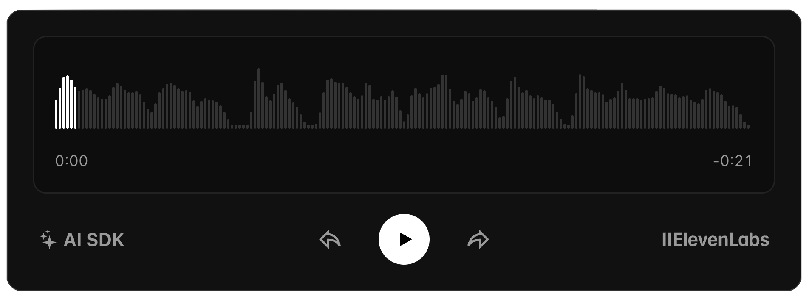

# AI SDK Page Summarizer Chrome Extension



A Chrome extension that generates trailer-like audio summaries of web pages using the [AI SDK](https://ai-sdk.dev) and [ElevenLabs](https://elevenlabs.io) text-to-speech.

## Installation

### Development Setup

1. **Clone the repository**
   ```bash
   git clone https://github.com/nicoalbanese/ai-sdk-chrome-extension-template.git
   cd ai-sdk-chrome-extension-template
   ```

2. **Configure API endpoint**

   Edit `extension/content.js`:
   ```javascript
   API_ENDPOINT: 'http://localhost:3000/api/summarize', // Development
   // API_ENDPOINT: 'https://your-api.vercel.app/api/summarize', // Production
   ```

3. **Load the extension in Chrome**
   - Open Chrome and navigate to `chrome://extensions/`
   - Enable "Developer mode" (top right)
   - Click "Load unpacked"
   - Select the `extension` directory

## Server Deployment

1. **Clone this repository**
2. **Create a new Vercel project**
3. **Import the repository**
4. **Configure the root directory:**
   - Click "Edit" next to Root Directory
   - In the modal that appears, select `server`
5. **Add environment variable:**
   - Add your ElevenLabs API key as `ELEVENLABS_API_KEY`
6. **Deploy the project**

## Usage

1. **Navigate to any article or blog post**
2. **Click the extension icon** in the Chrome toolbar
3. **Click "Generate trailer"** button that appears below the main heading
4. **Listen to the summary** using the audio player controls

### Playback Controls

- **Play/Pause** - Center button or spacebar when player is focused
- **Skip Backward** - Left arrow or rewind button (10 seconds)
- **Skip Forward** - Right arrow or forward button (10 seconds)
- **Seek** - Click anywhere on the waveform


## License

MIT License

## Learn More

- [AI SDK](https://ai-sdk.dev/) for AI integration
- [ElevenLabs](https://elevenlabs.io/) for text-to-speech